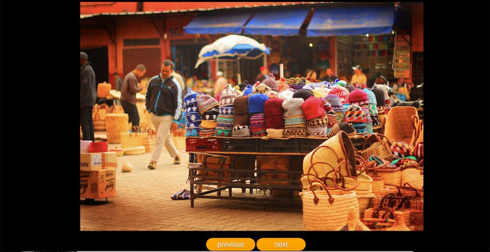

# Livraison 4 / Carousel JS (dans le cadre d'un exercise pour la formation) niveau à 2 mois sur 8 mois de formation

Pour cet exercise nous devions réaliser un carousel full vanilla JS sans framework.
La dificulté était que les images devaient se trouver dans des balises < Li >.
Ma source d'information principale : https://javascript.info/

>En formation avec l'organisme Simplon et Yes We Web pour devenir un futur devellopeur Web
